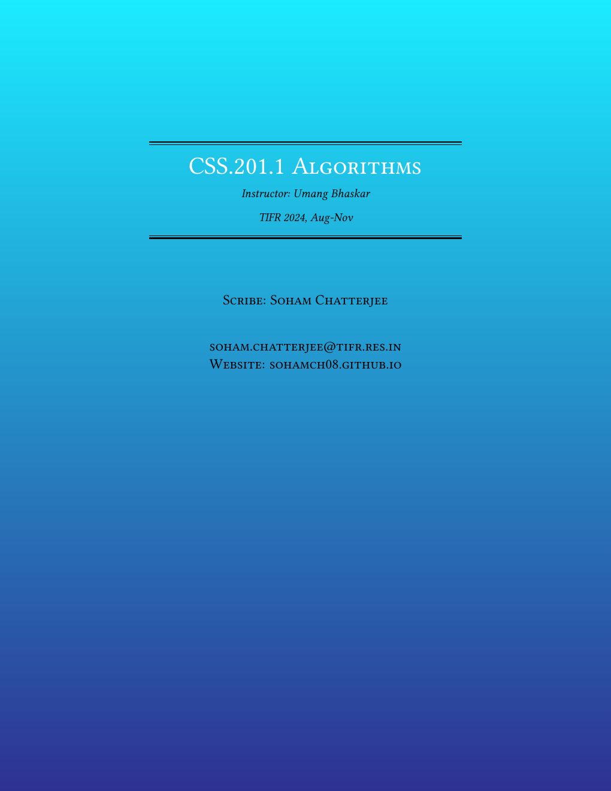
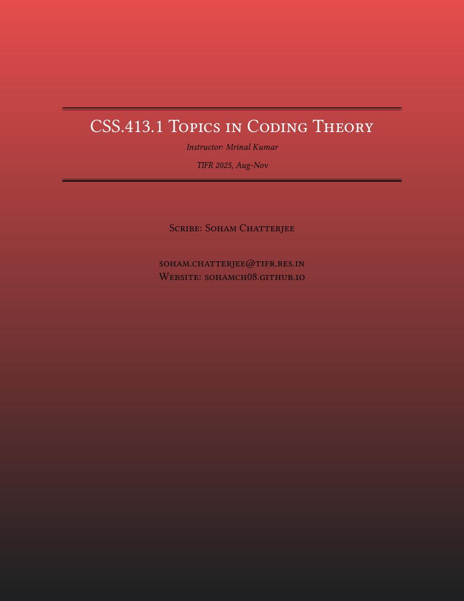
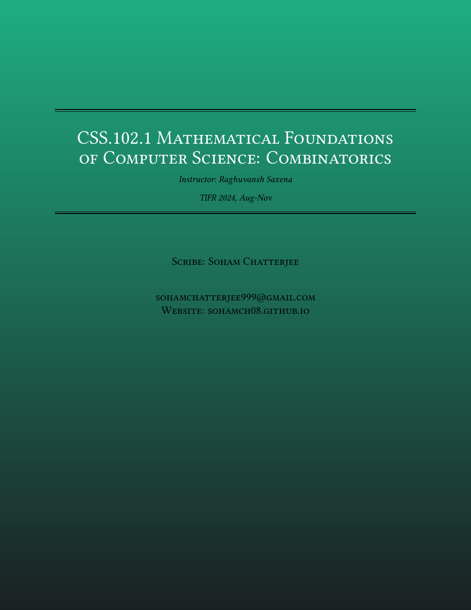
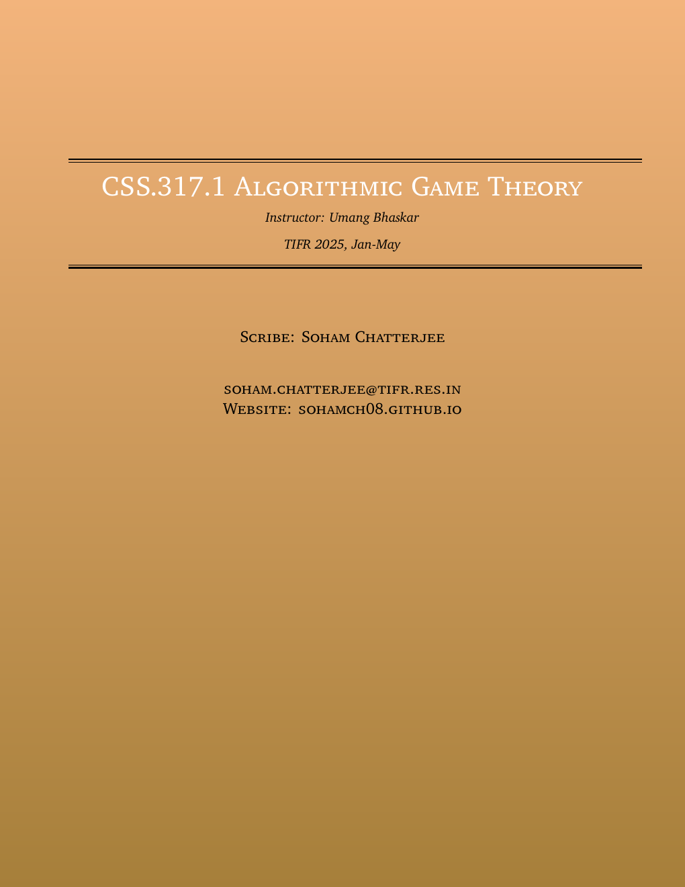
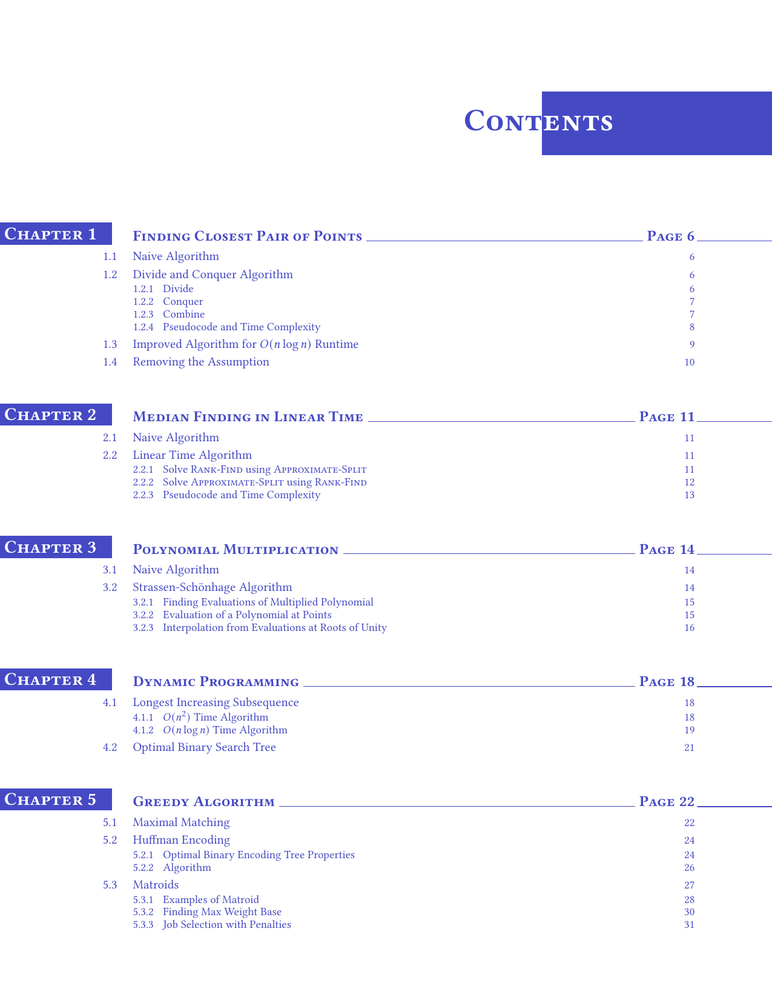

<div align="center">

# ✦ Lumina

**An eye-candy LaTeX theme for lecture notes, reports, and theses**

[](LICENSE)
[](https://www.latex-project.org/)
[](https://github.com/sohamch08/lumina/stargazers)

</div>

---

## Previews

 

---

## Showcase

Lumina has been used to typeset several lecture note sets and a full MSc thesis at TIFR Mumbai:

| Document | Repo |
|---|---|
| **Exponential Sums and Weil Bounds** — MSc project report | [](https://github.com/sohamch08/msc-project-tifr) |
| **Algorithms** (CSS.201.1) | [](https://github.com/sohamch08/Algorithms-CSS.201.1-TIFR-2024) |
| **Complexity, Coding Theory and more** | [](https://github.com/sohamch08/Academic-Notes) |

---

## Title Page

The gradient cover is the most popular style — a full-page TikZ background with a centered title block. Define `\titre` in your main `.tex` file and call it inside `\begin{titlepage}`:

```tex
\definecolor{mycolor1}{HTML}{E64C4C}  % top gradient color
\definecolor{mycolor2}{HTML}{1B2021}  % bottom gradient color

\newcommand{\titre}[2]{\begingroup
  \newlength{\drop}
  \setlength{\drop}{0.1\textheight}
  \centering
  \settowidth{\unitlength}{\Huge\scshape Your Course Name Here\hspace{3pt}-temps}
  \vspace*{\baselineskip}
  \rule{\unitlength}{1.6pt}\vspace*{-\baselineskip}\vspace*{2pt}
  \rule{\unitlength}{0.4pt}\\[\baselineskip]
  {\Huge\scshape\color{white} #1}\\[\baselineskip]
  {\large\itshape Instructor: #2}\\[0.2\baselineskip]
  \rule{\unitlength}{0.4pt}\vspace*{-\baselineskip}\vspace{3.2pt}
  \rule{\unitlength}{1.6pt}\\[4\baselineskip]
  {\Large\scshape Scribe: Your Name\\[10mm] email@institution.edu}\par
  \vfill
\endgroup}

\begin{document}
\thispagestyle{empty}
\begin{titlepage}
  \begin{tikzpicture}[remember picture,overlay]
    \node [xshift=\paperwidth/2,yshift=\paperheight/2] at (current page.south west)
      [minimum width=\paperwidth,minimum height=\paperheight,
       top color=mycolor1,bottom color=mycolor2]{};
  \end{tikzpicture}\\[3\baselineskip]
  \titre{Course Name}{Instructor Name}
\end{titlepage}
```

Different gradient colors give each document its own identity:

<table width="100%">
<tr>
<td align="center"><br><sub><b>Algorithms</b></sub></td>
<td align="center"><br><sub><b>Topics in Coding Theory</b></sub></td>
</tr>
<tr>
<td align="center"><br><sub><b>Mathematical Foundations of CS</b></sub></td>
<td align="center"><br><sub><b>Algorithmic Game Theory</b></sub></td>
</tr>
</table>

---

## Theorem Environments

Color-coded boxes for every mathematical environment. Theorem body text is set in italic by default.

| Environment | Color | Short command |
|---|---|---|
| Theorem | Blue | `\thm[ref]{Title}{Body}` |
| Lemma | Green | `\lem[ref]{Title}{Body}` |
| Claim | Green | `\clm[ref]{Title}{Body}` |
| Corollary | Purple | `\cor[ref]{Title}{Body}` |
| Definition | Red | `\dfn[ref]{Title}{Body}` |
| Example | Teal | `\ex[ref]{Title}{Body}` |
| Open Question | Purple | `\opn[ref]{Title}{Body}` |


Each environment has two variants: numbered within **sections** (lowercase, e.g. `lemma`) and within **chapters** (capitalized, e.g. `Lemma`). Short commands use the section variant; append `c` for the chapter variant (`\lemc`, `\corc`, `\thmc`, …).

---

## Referencing

Pass the ref name as the optional `[ref]` argument:

```tex
\thm[ftc]{Fundamental Theorem of Calculus}{Statement here.}
% refer elsewhere as \thmref{ftc}   →  "Theorem 1.1"
% or with link text: \hyperref[th:ftc]{Theorem \ref{th:ftc}}
```

| Environment | Prefix | Ref macro |
|---|---|---|
| Theorem / Claim / Lemma / Corollary | `th:` | `\thmref`, `\lmref`, `\corref` |
| Definition / Exercise / Open Question | `def:` | `\defref` |
| Example | `ex:` | — |
| Observation | (raw) | `\obsref` |

All ref macros accept an optional suffix: `\thmref[s]{ftc}` → "Theorem 1.1s".

---

## Proof Environments

```tex
\begin{proof}...\end{proof}
\begin{proof-sketch}...\end{proof-sketch}
\begin{proof-idea}...\end{proof-idea}
\begin{proof-attempt}...\end{proof-attempt}
\begin{alternate-proof}...\end{alternate-proof}
\begin{anotherproof}...\end{anotherproof}
\begin{combi-proof}...\end{combi-proof}     % Combinatorial Proof
\begin{alg-proof}...\end{alg-proof}         % Algebraic Proof
\begin{proofmany}[2]...\end{proofmany}      % Proof 2 / Proof (ii) etc.
\begin{want}...\end{want}                   % Want: ...
\begin{enough}...\end{enough}               % Enough to Show: ...
```

---

## Contents Page

A styled table of contents using TikZ. The chapter heading color and the ToC color are unified — both driven by a single `\definecolor{mytoccolor}{...}` definition, so changing one color updates the whole document.



> Avoid adjusting the page margins — the ToC layout depends on them.

---

## Macros

### Letter Fonts — [`letterfonts.tex`](letterfonts.tex)

```tex
\bbA   % Blackboard Bold  (\mathbb{A})
\bmA   % Bold Math        (\boldsymbol{A})
\sA    % Script           (\mathscr{A})
\mfA   % Fraktur          (\mathfrak{A})
\mcA   % Calligraphic     (\mathcal{A})
\ovA   % Overline, \tdA tilde, \vcA vec, \hA widehat
```

Greek shorthand: `\al` `\gm` `\dl` `\eps` `\veps` `\lm` `\sg` `\vph` `\om` (and their capitals).

### General Macros — [`macros.tex`](macros.tex)

```tex
\thmref[s]{ftc}         % Theorem 1.1s  (optional suffix)
\lmref{key}             % Lemma 2.3
\corref{key}            % Corollary 1.4
\obsref{key}            % Observation 5
\defref{key}            % Definition 2.1

\by{Theorem 1.1}        % &[By Theorem 1.1]  (proof alignment)
\byt{ftc}               % &[By Theorem 1.1]  (auto-linked)
\byl{key} \byc{key}     % &[By Lemma/Corollary ...]

\Leg{a}{p}              % Legendre symbol (a/p)
\Tfae                   % "The following are equivalent:"
\quot{G}{H}             % G / H  (inline quotient)
\matr{a & b \\ c & d}   % matrix without brackets
```

---

## Files

| File | Purpose |
|---|---|
| [`preamble.tex`](preamble.tex) | Core theme — colors, theorem boxes, ToC, title pages |
| [`preamble-article.tex`](preamble-article.tex) | Article variant (no chapters) |
| [`preamble-formal.tex`](preamble-formal.tex) | Formal/report variant |
| [`letterfonts.tex`](letterfonts.tex) | Font shorthands |
| [`macros.tex`](macros.tex) | Math macros |
| [`main.tex`](main.tex) | Minimal working example |
